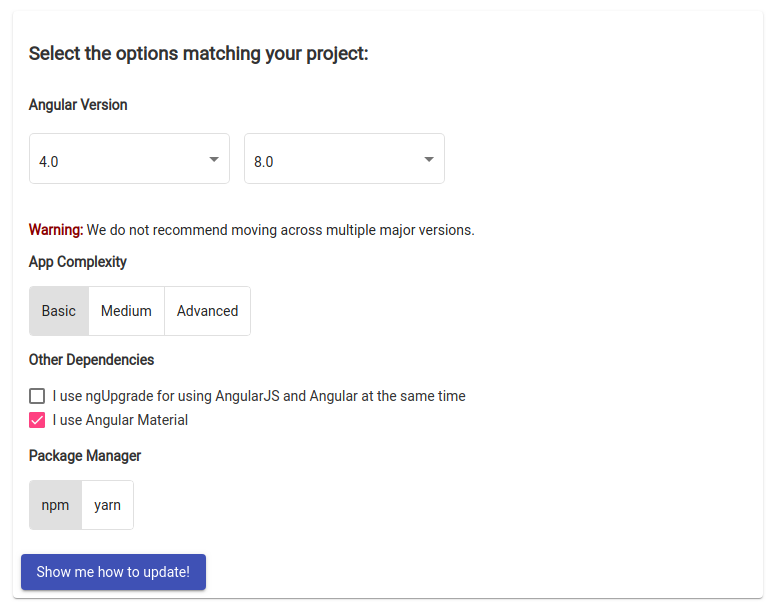

# Upgrade Guide

This document will detail the steps needed to upgrade this application from
its current version to the latest version to date. It includes details on
not only the libraries to update but also how to successfully implement these
upgrades.

# Upgrading Angular

The version of Angular currently installed in this project is version `^4.0.0`
which at the current time is 4 major revisions behind. Angular provides a
webpage that gives instructions on how to update versions and what caveats to
be aware of. In this instance we will be following the
[version 4.0 to 8.0 upgrade guide](https://update.angular.io/#4.0:8.0).

> Note: While Angular does not recommend moving across multiple versions
> at the same time, the app in our case is simple enough that our upgrade
> path does not require moving through each individual version, rather we can
> make all of the required changes easily to make the move.



Above are noted the settings we will be using for the angular update helper.

- Version 4.0 -> Version 8.0
- Basic complexity (the app is simple having only 1 page and 2-3 components)
- Angular Material checked
- Package manager of your choice (in this document we will use npm)

Clicking <i>Show me how to update!</i> will reveal a list of items that will
need to be addressed for the upgrade to be successful. This document will
condense down the steps required for a successful upgrade as not everything
in the list provided applies to this application.

## Make sure you are running Node 10 or later

The first step to updating successfully is verifying that you are running
Node version 10.x.x or later. You can verify this by running

```sh
$ node --version
v10.15.3
```

If you do not have node installed or are running a version lower than 10.x,
you can obtain the latest version from the [node.js official website](https://nodejs.org/en/).

We will also want to make sure that our npm version is up to date. This can be
done by updating npm, either by installing the latest version of node or running:

```sh
$ npm install -g npm@latest
```

## Update the Angular CLI

We will update the Angular CLI to latest stable. This can be done by running
the following command at the root of the project.

```sh
$ npm install @angular/cli@latest
```

This will install the latest version of the Angular CLI. This version of the
CLI provides several helpful features that we will be able to use to update
the app successfully.

## Remove unneeded dependencies

In Angular version 5, the `@angular/http` package was deprecated in favor of
a newer package. We will want to remove this package from our code. We also
have `@angular/flex-layout` installed but the library isn't used anywhere in
our code. This package will also be removed. Remove these packages with the
following command.

```sh
$ npm uninstall @angular/http @angular/flex-layout
```

## Updating `@angular/cli`

At this point, we will want to commit our changes. The Angular CLI provides
a helpful update command that we can use, but it requires that the code
be free of uncommitted changes. Once the previous changes are committed,
we will run ng update with the help of [npx](https://www.npmjs.com/package/npx)
(This library comes installed with the latest versions of npm)

```sh
$ npx ng update @angular/cli
```

This command will make several changes to the code. It will:

- Rename `.angular-cli.json` to `angular.json` and update the structure
- Update the `browserlist` file
- Update `karma.conf.js`
- Update the various `tsconfig.json` files
- Update the `polyfills.ts` file.

Once this command is complete, we will once again commit our code. Once
our code is committed we will next update `@angular/core`

> Note that here we use `--force` on this command. Because we are jumping multiple
> versions, the update script will complain that the `@angular/material` version
> is incompatible with the proposed changes. This is OK as we will be manually
> updating this package in the next step.

```sh
$ npx ng update @angular/core --force
```

This command will update all of the versions in the `package.json` file. You
can see that the versions were updated to the latest versions.

## Updating `@angular/material`

While the Angular CLI does provide an update script for updating `@angular/material`
the same as we did for the CLI and the core package, at the current time that
script installs the beta version `9.0.0-next.0`. We want to avoid that and make
sure that we keep all of the major versions of our Angular packages in sync
so we will manually install the version we want to with the following command:

> The `@latest` part of the command installs the latest stable version

```sh
$ npm i @angular/material@latest @angular/cdk@latest
```
